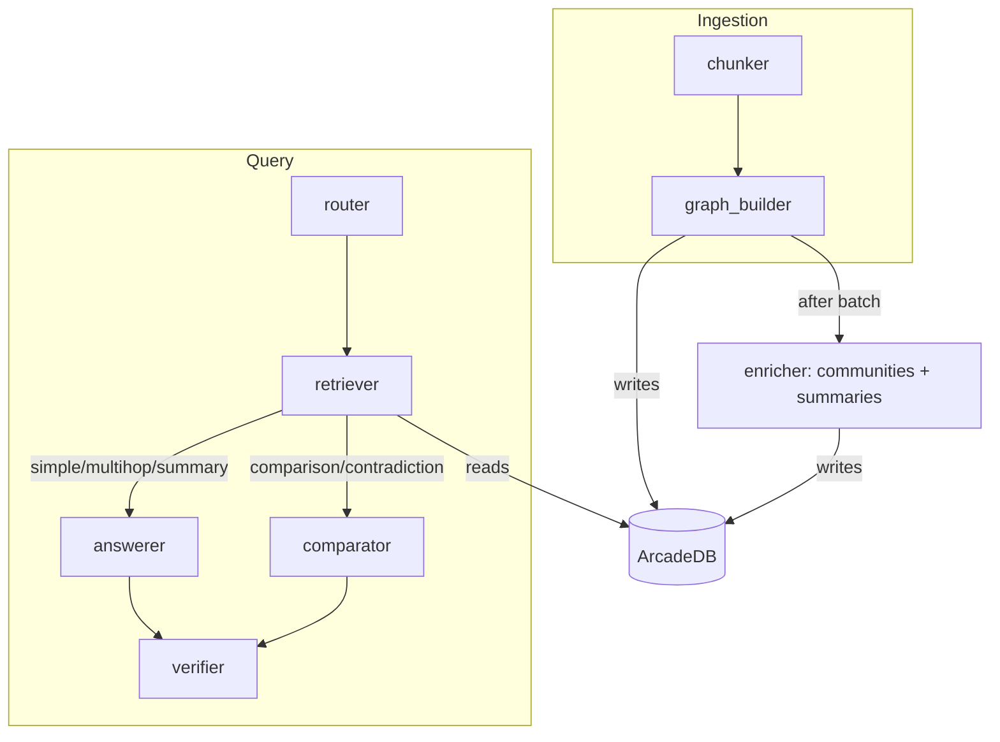
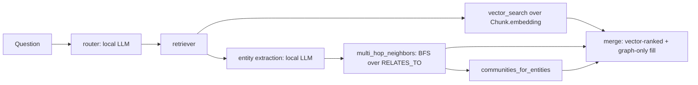

# Architecture

Audited against local checkout `7265710424ffe7f5f63b37718cf703713063fbec` on
`main` (remote `https://github.com/pypi-ahmad/document-intelligence-agent.git`),
2026-08-17. License: MIT (`LICENSE`). Citations point to files in this
checkout.

## What this is

A local, single-user Streamlit application that builds a GraphRAG knowledge
graph from PDFs and answers questions over it. Two LangGraph state machines
do the work: an **ingestion graph** (`chunker → graph_builder`, run once per
document, then a shared `enricher` pass over the batch) and a **query graph**
(`router → retriever → answerer|comparator → verifier`). The graph itself —
documents, chunks, entities, relationships, and hierarchical community
summaries — is persisted in [ArcadeDB](https://arcadedb.com/), a graph
database accessed over its HTTP REST API (`db/arcade_client.py`).

## Tech stack

| Layer | Technology | Evidence |
|---|---|---|
| UI | Streamlit | `app.py:8,17` |
| Orchestration | LangGraph `StateGraph`, two separate compiled graphs (no shared checkpointer — see below) | `graph.py:19-55` |
| Graph database | ArcadeDB, accessed via a hand-written `requests`-based REST client | `db/arcade_client.py:1-12,48-66` |
| Local LLM | Ollama (`qwen3.5:2b` default) — routing, extraction, simple answers, base groundedness | `config.py:33,74-83` |
| Complex LLM | OpenAI-compatible endpoint or Agnes AI (`ChatOpenAI` client either way) — multi-hop, summary, comparison, contradiction, cross-doc verification | `config.py:85-105` |
| Local embeddings | Ollama (`nomic-embed-text-v2-moe` default) | `embeddings.py:10-14`, `config.py:34` |
| Community detection | NetworkX, Louvain (two levels) | `agents/enricher.py:13,74,129` |
| PDF parsing | `pypdf` | `utils.py:25-30` |
| Chunking | `langchain_text_splitters.RecursiveCharacterTextSplitter`, paragraph-first separators, per-page | `utils.py:33-42` |
| Package management | `uv` (`pyproject.toml`/`uv.lock`) | `pyproject.toml` |

## Entry point

`uv run streamlit run app.py`, or `launch.cmd` (Windows: installs `uv` if
missing, `uv sync`, pulls the two Ollama models if absent, starts the
ArcadeDB container, launches). `app.py` is the only UI entry point; there is
no CLI or API entry point.

## Commands & Verification Inventory

| Command | Purpose | Evidence |
|---|---|---|
| `uv sync` | Install dependencies from `uv.lock` | `pyproject.toml`, `README.md` |
| `uv run streamlit run app.py` | Run the app | `README.md` |
| `launch.cmd` | Windows one-click: installs `uv`/checks Ollama+Docker, pulls models, starts ArcadeDB, launches | `launch.cmd` |
| `uv run ruff check .` | Lint (`E, F, W, I, UP, B, SIM, RUF, N, C4`) | `pyproject.toml:18-29` |
| `uv run ty check` | Typecheck | `pyproject.toml:20,31-32` |

Both lint and typecheck commands are configured as dev dependencies with
real rule/environment config and **pass clean today** (verified live,
2026-08-17) — they are just not run automatically by anything. **No test or
CI command exists**: no `pytest`/test directory, no `.github/workflows/`.
Confirmed by directory listing, 2026-08-17.

## Directory layout

| Path | Purpose |
|---|---|
| `app.py` | Streamlit UI: ingest sidebar, knowledge-graph stats/docs/summaries, reset, chat |
| `graph.py` | LangGraph wiring for both pipelines |
| `state.py` | `IngestState`/`QueryState` `TypedDict` schemas |
| `config.py` | Env var reads, `get_llm("local"\|"complex")` factory |
| `embeddings.py` | Local embedding model wrapper + dimension probe |
| `utils.py` | PDF page extraction, chunking, id/JSON helpers |
| `agents/chunker.py` | Per-page PDF extraction → paragraph-first chunks |
| `agents/graph_builder.py` | Per-chunk embedding + entity/relation extraction → ArcadeDB |
| `agents/enricher.py` | Louvain community detection + 4-level hierarchical summarization |
| `agents/router.py` | Question → one of 5 modes (skipped if UI already forced one) |
| `agents/retriever.py` | Hybrid vector search + multi-hop `RELATES_TO` BFS + community context |
| `agents/answerer.py` | Grounded, cited answer generation (simple/multi-hop/summary) |
| `agents/comparator.py` | Multi-document comparison/contradiction specialist |
| `agents/verifier.py` | Groundedness check + cross-document contradiction pass |
| `db/arcade_client.py` | ArcadeDB REST client: schema, CRUD, BFS, vector search, stats, reset |
| `arcadedb-data/` | Docker volume: persisted graph data. Not committed. |

## Deployment & runtime surface

Local-only; no container image is built for the app itself (only ArcadeDB
runs in Docker, via the official `arcadedata/arcadedb:26.5.1` image).
`README.md` badges Python 3.11+; no `.python-version` pins an exact
interpreter in this checkout — the floor is asserted only in a badge.
ArcadeDB's container publishes ports `2480`/`2424` on all interfaces (not
loopback-restricted) with the documented default root password
(`playwithdata`) unless the operator changes it — see `SECURITY.md`.

## EOL / dead-dependency scan

Nothing EOL. Dependencies are pinned in `uv.lock`, so exact versions are
knowable rather than inferred. The two Ollama models (`qwen3.5:2b`,
`nomic-embed-text-v2-moe`) are pulled by name, not pinned to a specific
Ollama-registry digest — an `ollama pull` on a different day could resolve
to a different underlying model version. No version-pin mechanism exists
for this today (`launch.cmd`, README's manual setup).

## Data, APIs, background jobs, CI/CD, testing

- **Data:** the knowledge graph — `Document`, `Chunk` (with embedding
  vectors), `Entity`, `Community` vertices and `HAS_CHUNK`/`MENTIONS`/
  `RELATES_TO`/`BELONGS_TO`/`PART_OF` edges — lives entirely in ArcadeDB,
  backed by a Docker volume (`db/arcade_client.py:91-119`). No other
  database or schema migration path exists.
- **APIs:** none exposed by this app; it is a client of Ollama, ArcadeDB's
  REST API, and whichever complex-LLM endpoint is configured.
- **Background jobs:** none; ingestion and enrichment run synchronously
  inside the Streamlit request that triggered them (`app.py:59-73`).
- **CI/CD:** none exists.
- **Testing:** none exists — no test files, no test runner wired up.

## Architectural blueprint





**Layering:** `app.py` (UI) → `graph.py` (orchestration) → `agents/` (domain
logic) → `db/arcade_client.py` + `embeddings.py` + `config.py` (infrastructure).
Nothing in `agents/`, `db/`, or `embeddings.py` imports `app.py` or
`graph.py` — one-way by convention, not enforced by any import-linter.

**Cross-cutting concerns**

| Concern | Location | Evidence |
|---|---|---|
| Config/secrets | `.env` via `python-dotenv`, read once at import time | `config.py:10-14` |
| Error handling | `ArcadeDBError` wraps connection/HTTP failures with an actionable message; per-chunk extraction failures degrade to empty lists rather than aborting the document | `db/arcade_client.py:28-58`, `agents/graph_builder.py:83-86` |
| LLM output parsing | `safe_json_loads` tolerates ` ```json ` fences and stray prose around JSON | `utils.py:45-60`, used by every agent that expects structured output |
| Provider routing | one function, `config.get_llm(role)`, is the single choke point for "local" vs. "complex" | `config.py:67-107` |

**Inferred ADRs**

- **ADR: Two independent LangGraph state machines, no shared checkpointer.**
  *Context:* ingestion and querying are separate concerns with separate
  state shapes. *Decision:* `get_ingestion_graph()` and `get_query_graph()`
  are each compiled once (`lru_cache`) with no `checkpointer` argument —
  every `.invoke()` is a single-shot run; there is no pause/resume or
  multi-turn state persisted by LangGraph itself (`graph.py:19-55`).
  *Consequences:* multi-turn chat context lives only in Streamlit's
  `session_state.chat_history` (`app.py:139-140,233`), not in LangGraph
  state — a new question starts a fresh graph run with no memory of prior
  turns except what's re-typed into the question.
- **ADR: Enrichment runs once per batch, not per document.** *Context:*
  community detection over the whole entity graph is comparatively
  expensive and would be wasted if a later document in the same batch
  changes community membership. *Decision:* `graph_builder` never calls the
  enricher; `app.py` calls `run_enrichment()` once after every file in a
  batch has been chunked and graph-built (`app.py:59-73`,
  `agents/enricher.py:174-181`). *Consequences:* communities/summaries are
  stale until the next ingestion batch or corpus-summary read — ingesting
  one document does not retroactively re-summarize communities touched by
  a document ingested five minutes earlier in a separate batch.
- **ADR: Hybrid retrieval fills remaining slots with graph-only hits
  instead of scoring them.** *Context:* vector hits carry a real cosine
  distance; graph-hop hits don't have a comparable score. *Decision:* rank
  vector hits by distance, then append graph-only chunks to fill
  `TOP_K_FINAL`, rather than inventing a fake distance for graph hits
  (`agents/retriever.py:80-89`). *Consequences:* graph-only chunks are
  never ranked *above* a vector hit, even if they're more relevant — a
  deliberate simplicity tradeoff, not a bug.
- **ADR: Groundedness check always local; contradiction check always
  complex.** *Context:* verifying "is this answer supported by its
  context" is a simpler task than "find a real cross-document
  contradiction." *Decision:* `verifier` always calls `get_llm("local")`
  for the groundedness pass, and only calls `get_llm("complex")` for
  comparison/contradiction modes' cross-document consistency pass
  (`agents/verifier.py:39-66`). *Consequences:* verification cost and
  latency scale with mode — simple/multi-hop/summary questions never incur
  a second complex-provider call just to verify their answer.

**Governance:** none — no CODEOWNERS, no branch protection, no CI to
protect against in the first place.

**How to add a feature:** add or modify a node function in `graph.py`
(ingestion or query graph), extend `IngestState`/`QueryState` in `state.py`
if new fields are needed, add any new ArcadeDB schema/queries to
`db/arcade_client.py` (it owns the whole schema — don't scatter raw SQL
elsewhere), and update `README.md`'s "How It Works" section and project
structure tree in the same change (convention only, nothing enforces it).

## Subsystem deep-dives

### 1. Knowledge graph construction (`agents/graph_builder.py`, `db/arcade_client.py`)

Per chunk: embed the text (Ollama), then ask the local LLM in JSON mode to
extract entities (`name`, `type`, `description`) and relations (`source`,
`relation`, `target`, `description`) from that chunk alone
(`agents/graph_builder.py:18-32,49-60`). Entities are **upserted by
`(name, type)`** — `upsert_entity()` matches on exact name+type, keeping the
longer of the old/new description (`db/arcade_client.py:175-195`) — so the
same real-world entity mentioned in different chunks (even different
documents) merges into one graph node, which is what makes cross-document
comparison and multi-hop traversal possible at all. Relations are
deduplicated by `(source, target, label)` before being written
(`db/arcade_client.py:210-222`). A failed extraction call degrades to empty
entities/relations for that one chunk rather than aborting the document
(`agents/graph_builder.py:83-86`) — one bad chunk doesn't lose the rest.

### 2. Hierarchical community summarization (`agents/enricher.py`)

Runs Louvain community detection (`networkx`, `seed=42` for reproducibility)
over the full `Entity`/`RELATES_TO` graph, summarizing each level-0 community
from its member entities' names, relation labels, and up to 5 representative
chunk excerpts (`agents/enricher.py:65-104`). If there's more than one
level-0 community, it builds a **coarse graph** where each node is a
level-0 community and edges are weighted by the real count of
cross-community `RELATES_TO` edges between their members — then runs
Louvain again on that coarse graph to form level-1 "super-communities"
(`agents/enricher.py:107-140`). This is real relation-density clustering,
not a co-occurrence heuristic. Document summaries and one corpus-wide
summary (the only place that uses the complex LLM in this subsystem) are
generated separately, from each document's own chunks/entities
(`agents/enricher.py:143-171`).

### 3. Hybrid query pipeline (`agents/router.py`, `agents/retriever.py`)

The router only classifies when the UI mode is "Auto" — an explicit UI mode
selection is honored as-is, skipping the LLM call entirely
(`agents/router.py:29-32`). The retriever always runs vector search
(`ArcadeDB` `LSM_VECTOR` cosine similarity), and separately extracts named
entities from the question text via a second local-LLM call
(`agents/retriever.py:33-38`). If any question entities match graph
entities by name, it does a BFS over `RELATES_TO` for 1 hop (simple/summary
questions) or `MAX_HOPS` (multihop/comparison/contradiction) and pulls
chunks mentioning the resulting entity set plus any community summaries
those entities belong to (`agents/retriever.py:59-73`,
`db/arcade_client.py:239-267,285-292`). The result is a hybrid context set:
vector-similar chunks ranked by distance, graph-reachable chunks appended
to fill remaining slots (see the ADR above), plus up to 5 community
summaries for corpus-level context.

## Confidence assessment

| Claim area | Confidence |
|---|---|
| Pipeline structure, node responsibilities, mode routing | High — read directly from `graph.py`, `agents/*.py` |
| ArcadeDB schema and query shapes | High — read directly from `db/arcade_client.py` |
| No CI/tests exist | High — confirmed by directory listing, not inference |
| Community detection and hierarchical summarization logic | High — read directly from `agents/enricher.py` |
| Ollama model versions being "current" (no per-digest pin) | Inferred — models are pulled by name only, no way to verify which exact model version is running without querying Ollama directly |
| ArcadeDB default-credential/network-binding exposure | High — read directly from `launch.cmd` and the README's manual `docker run` command |

## Footnotes

- `README.md` — features, tech stack, setup, env vars, "How It Works" narrative
- `graph.py` — LangGraph wiring for both pipelines
- `state.py` — `IngestState`/`QueryState` schemas
- `config.py` — env var reads, constants, `get_llm()` factory
- `app.py` — Streamlit UI and pipeline wiring
- `agents/chunker.py`, `agents/graph_builder.py`, `agents/enricher.py`, `agents/router.py`, `agents/retriever.py`, `agents/answerer.py`, `agents/comparator.py`, `agents/verifier.py` — the eight pipeline agents
- `db/arcade_client.py` — ArcadeDB REST client and full graph schema
- `embeddings.py` — local embedding model wrapper
- `utils.py` — PDF extraction, chunking, id/JSON helpers
- `CONTRIBUTING.md`, `SECURITY.md`, `DISCLAIMER.md` — community docs and the local-vs-cloud data-flow / ArcadeDB-credential facts they document
